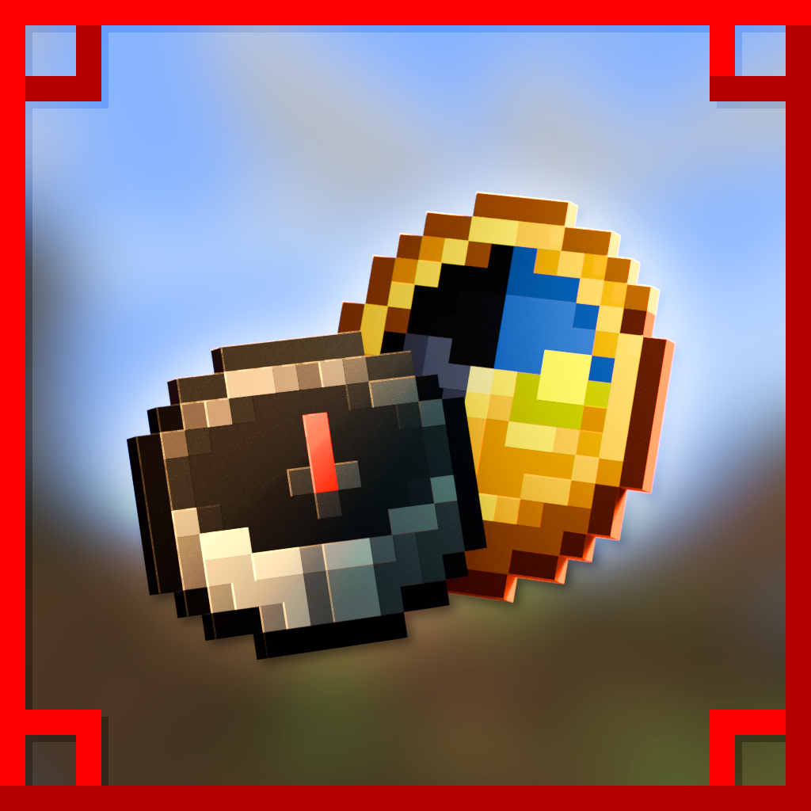

## **About Interfaced**

Interfaced is a small Minecraft mod for [Fabric](https://fabricmc.net) 1.21.1 that improves upon various GUIs in the game. This mod aims to come up with more elegant solutions to the way information is displayed, from replacements for unimmersive debug menus and more!

## **Information**

For more information about Interfaced, please check out the [Wiki](https://github.com/Sydokiddo/interfaced/wiki)!

## **Download**

Interfaced can be downloaded from these sources:

- [Current Version: 0.0.2]

* [CurseForge](https://www.curseforge.com/minecraft/mc-mods/interfaced)
* [Modrinth](https://modrinth.com/mod/interfaced)